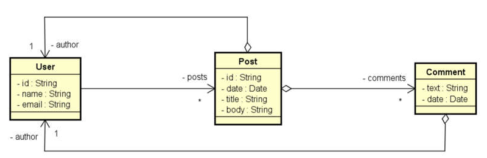

# RESTful API
RESTful API using Spring Boot and MongoDB developed in the course [Java COMPLETO Programação Orientada a Objetos +Projetos](https://www.udemy.com/course/java-curso-completo/)

## Class Diagram



## Tecnologies

- Java 11
- MongoDB and Mongo Compass
- Spring Boot

## How to Run

1. Clone the repository
```
git clone https://github.com/ArthurCech/restful-api-course-udemy-mongodb.git
```

2. Create database in MongoDB with the name workshop_mongo or another name of your choice (you'll have to change at application.properties)

3. Run the app using maven
```
mvn spring-boot:run
```